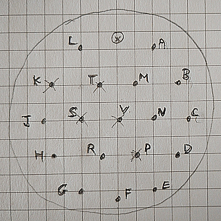

# Precision_Altimeter_Presentation_Unit
Smiths Industries P/N PW0104KAP-DA1 SER.No. OS141 
Made in Cheltenham England

Ref: 6A/6610-99-1141087

[Overview photo](images/Overview.jpg)

## Connections

### Connector-18way -PL3 & PL6 view from rear

 

### PL3 main interface

|Pin|Colour  |Function             |
|---|--------|---------------------|
| A |orange  |Synchro Input        |
| B |orange  |Synchro Input        |
| C |yellow  |Synchro Input        |
| D |orange  |-ve power input      |
| E |orange  |common power return  |
| F |orange  |+28 VDC power input  |
| G |yellow  |test button input    |
| H |yellow  |test button return   |
| J |N/C     |-                    |
| K |yellow  |115v VAC 400Hz ref   |
| L |green/Y |flag motor Red *     |
| M |green/R |flag motor W         |
| N |green/O |flag motor Y         |
| P |yellow/Y|115 VAC return       |
| R | N/C    |-                    |
| S | N/C    |-                    |
| T | N/C    |-                    |
| V | N/C    |-                    |

\* Flag motor return BK to PL3-K

 

Note: !! pin numbers and max values for another unit !!

| Bit #|Max   |Pin -#|
|------|------|----- |
| C4   |-1200 |  9   |
| C2   |-1000 |  4   |
| C1   |-800  |  3   |
| B4   |-300  |  2   |
| B2   | 700  |  1   |
| B1   |2700  |  8   |
| A4   |6700  |  7   |
| A2   |14700 |  6   |
| A1   |30700 |  5   |
| D4   |62700 |      |
| D2   |126700|      |
| D1   |  ?   |      |
|Common|      | 15   |

 

### PL6 Gillham encoder output

|Pin|Colour       |Function|
|---|-------------|--------|
| A |Yellow       | B2     |
| B |Orange       | B4     |
| C |Red          | C1     |
| D |Brown        | C2     |
| E |White        | A1     |
| F |Grey         | A2     |
| G |Blue         | A4     |
| H |Green        | B1     |
| J |Black        | C4     |
| K |N/C          |  -     |
| L |Yellow/White | D2     |
| M |Brown/White  | D4     |
| N |* LimeGreen  | D1     |
| P |N/C          | -      |
| R |Black/White  | Common |
| S |N/C          | -      |
| T |N/C          | -      |
| V |N/C          | -      |

\* PL6-R Common is connected to chassis
\* PL6-N LimeGreen is conneced via relay contacts to encoder Blue/White

#### Relay normally closed energised, when 28V power applied

|Terminal|wire|destination|
|--|--|--|
|coil-a|green-B||
|coil-b|green-M||
|contact-a|Green-Gy|PL6-N|
|contact-b|Blue/White|Encoder|

 

### PL4 Warning light

|Pin|Function              |     |
|-----|--------------------|-----|
| A   |warning light +ve   |     |
| B   |warning light return|     |

