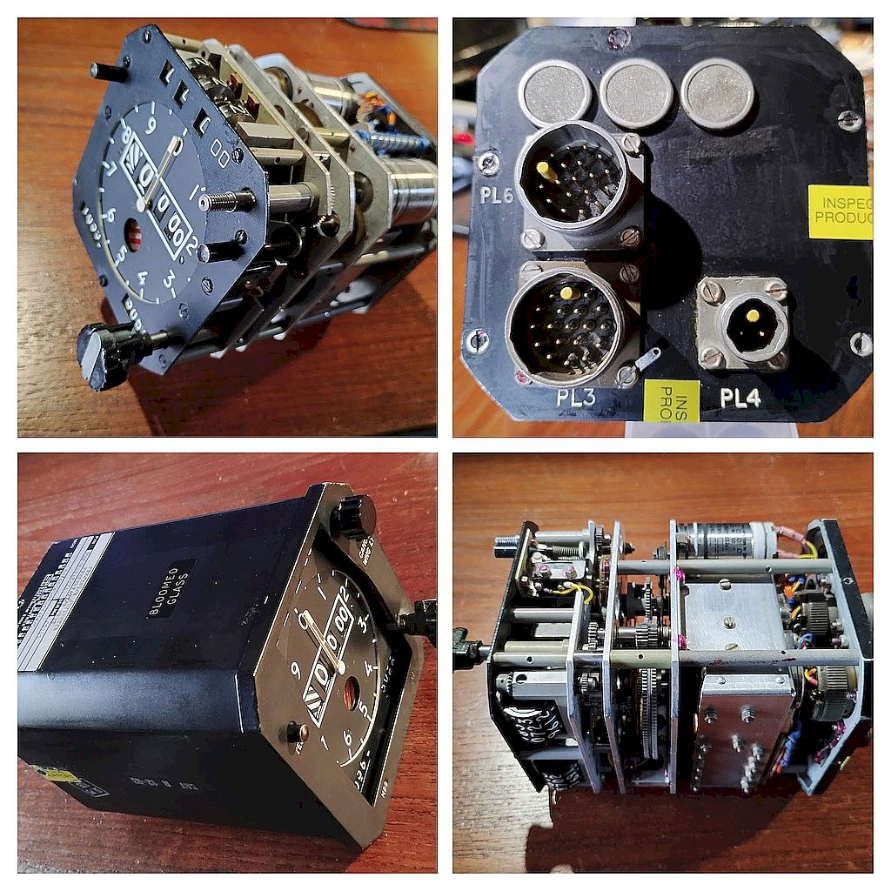

# Precision_Altimeter_Presentation_Unit
Smiths Industries P/N PW0104KAP-DA1 SER.No. OS141 
Made in Cheltenham England

Ref: 6A/6610-99-1141087

## Connections

 
### PL3

|Pin|Function                    |     |
|---|----------------------------|-----|
| A |Synchro Input               |     |
| B |Synchro Input               |     |
| C |Synchro Input               |     |
| D |-ve power input             |     |
| E |common power return         |     |
| F |+28 VDC power input         |     |
| G |test button input           |     |
| H |test button return          |     |
| J |?                           |     |
| K |115v VAC 400Hz reference    |     |
|   |                            |     |
| L |flag motor Red (ret BK to K)|     |
| M |flag motor W                |     |
| N |flag motor Y                |     |
| P |115 VAC return              |     |
| R |                            |     |
| S |                            |     |
| T |                            |     |
| V |                            |     |

 
### PL4

|Pin|Function              |     |
|-----|--------------------|-----|
| A   |warning light input |     |
| B   |warning light return|     |

 
### Gillham encoder output 

Note: !! pin numbers and max values for another unit !!

| Bit #|Max   |Pin -#|
|------|------|----- |
| C4   |-1200 |  9   |
| C2   |-1000 |  4   |
| C1   |-800  |  3   |
| B4   |-300  |  2   |
| B2   | 700  |  1   |
| B1   |2700  |  8   |
| A4   |6700  |  7   |
| A2   |14700 |  6   |
| A1   |30700 |  5   |
| D4   |62700 |      |
| D2   |126700|      |
| D1   |  ?   |      |
|Common|      | 15   |

 
### PL6

|Pin|Function          |     |
|---|------------------|-----|
| A |                  |     |
| B |                  |     |
| C |                  |     |
| D |                  |     |
| E |                  |     |
| F |                  |     |
| G |                  |     |
| H |                  |     |
| J |                  |     |
| K |                  |     |
| L |                  |     |
| M |                  |     |
| N |                  |     |
| P |                  |     |
| R |                  |     |
| S |                  |     |
| T |                  |     |
| V |                  |     |
